# Arsitektur Sistem Terdistribusi

## Gambaran Umum

Sistem mengimplementasikan tiga komponen sinkronisasi terdistribusi yang berjalan dalam Docker cluster dengan total 14 container:

| Komponen | Algoritma | Nodes | Poin |
|---|---|---|---|
| Distributed Lock Manager | Raft Consensus + PBFT | 4 | 25 |
| Distributed Queue | Consistent Hashing | 3 | 20 |
| Distributed Cache Coherence | MESI Protocol | 3 | 15 |
| Containerization | Docker Compose | — | 10 |

---

## Diagram Arsitektur Keseluruhan

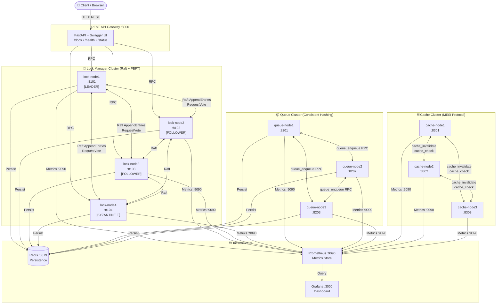

---

## Komponen A: Distributed Lock Manager (Raft Consensus)

### State Machine Raft

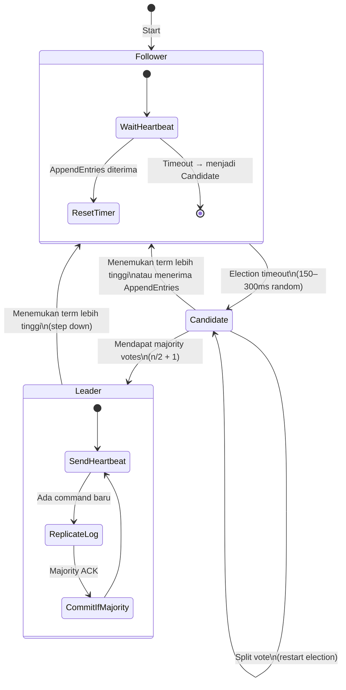

### Alur Log Replication

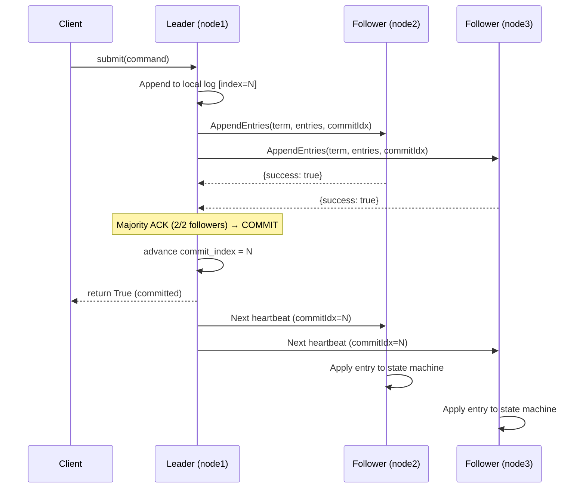

### Deadlock Detection — Wait-For Graph

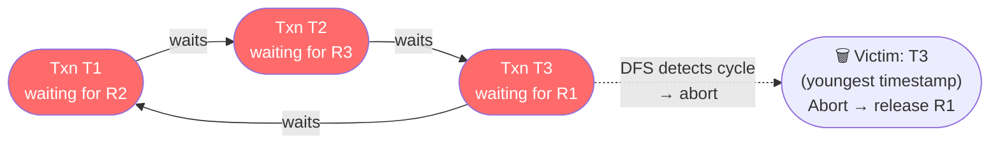

### Lock Compatibility Matrix

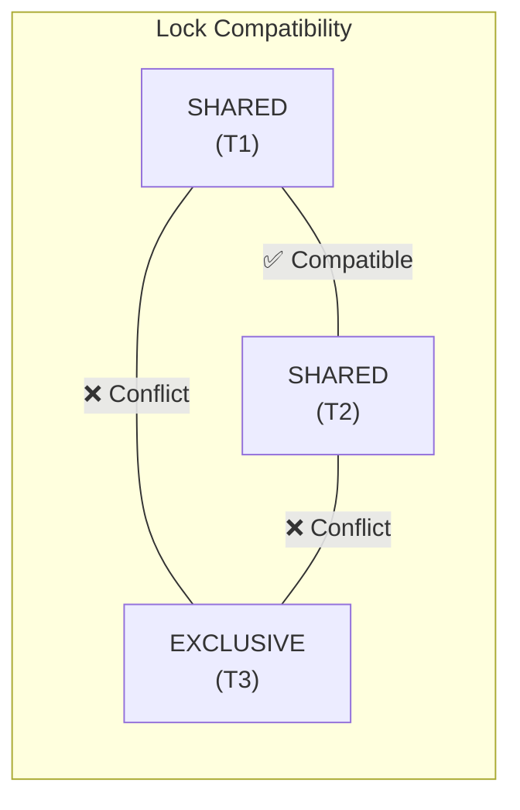

---

## Komponen B: Distributed Queue (Consistent Hashing)

### Consistent Hash Ring

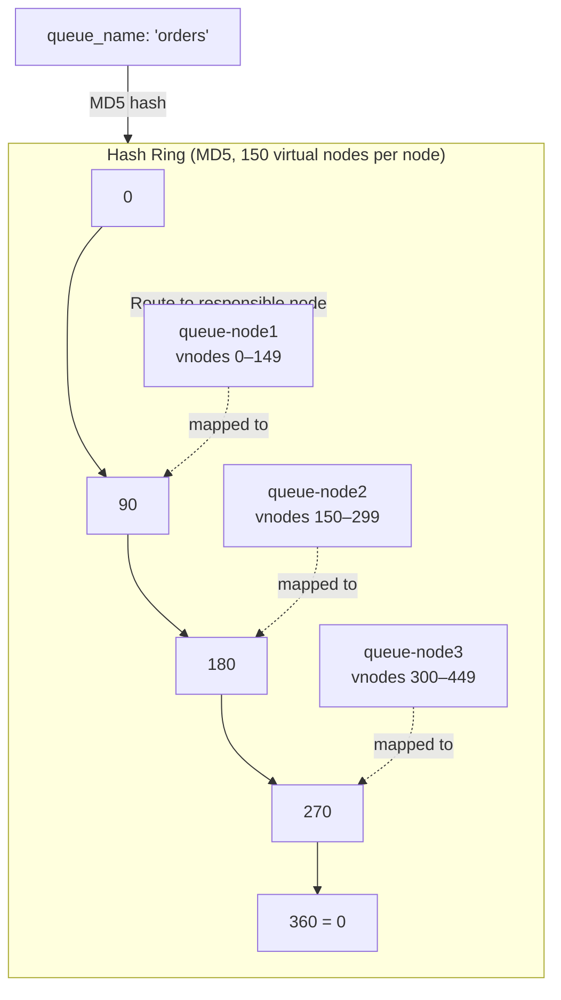

### Alur At-Least-Once Delivery

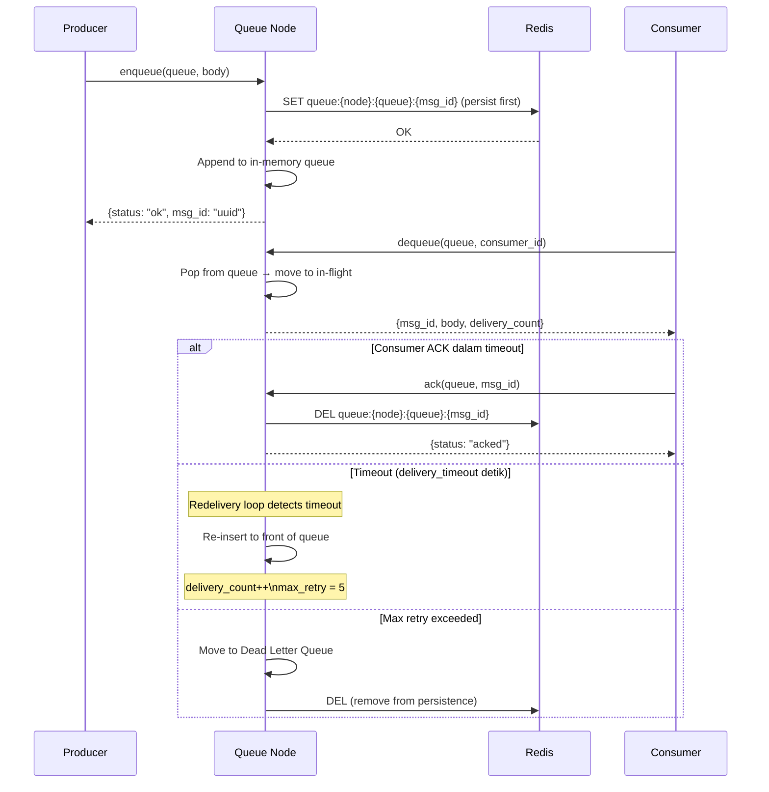

### Recovery dari Node Failure

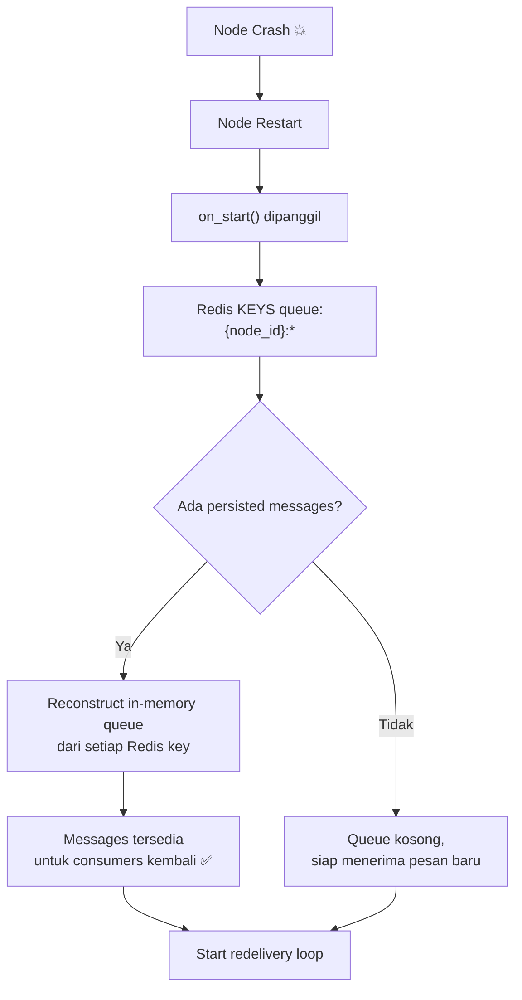

---

## Komponen C: Cache Coherence (MESI Protocol)

### State Transitions MESI

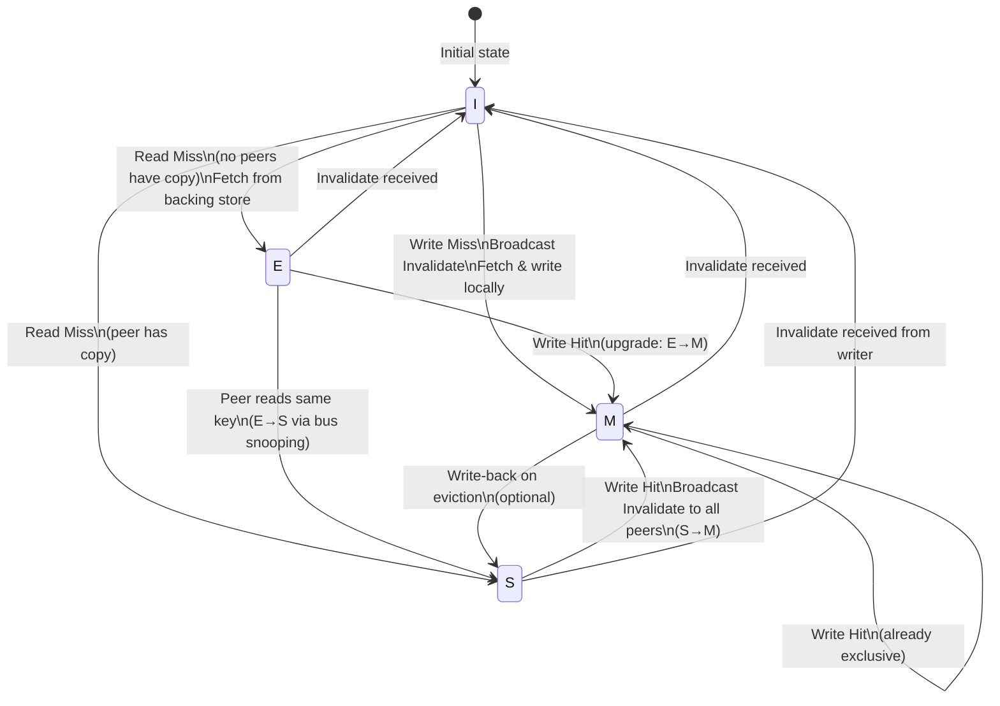

### Alur Write Protocol (S→M)

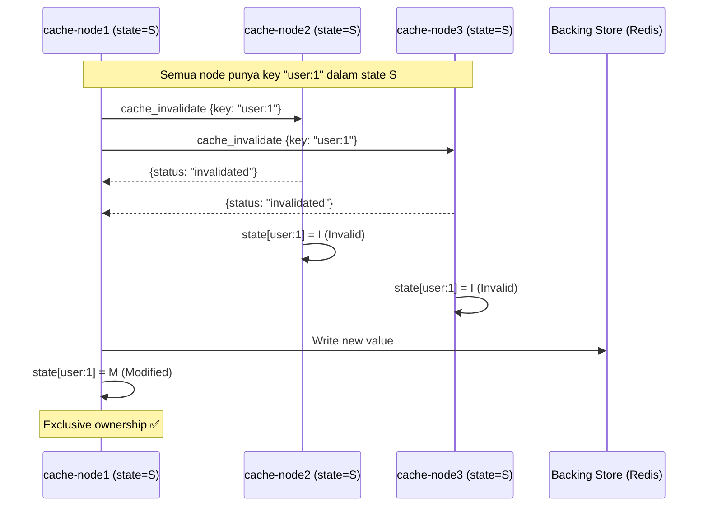

### LRU Cache Implementation

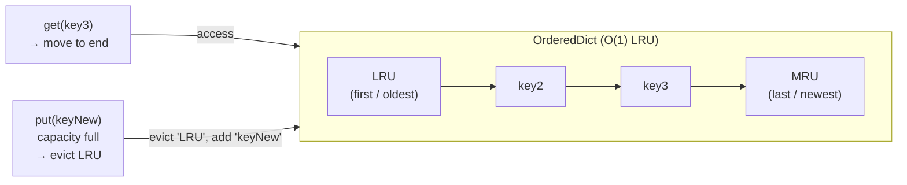

---

## Bonus: PBFT Byzantine Fault Tolerance

### Fase PBFT (3-Phase Protocol)

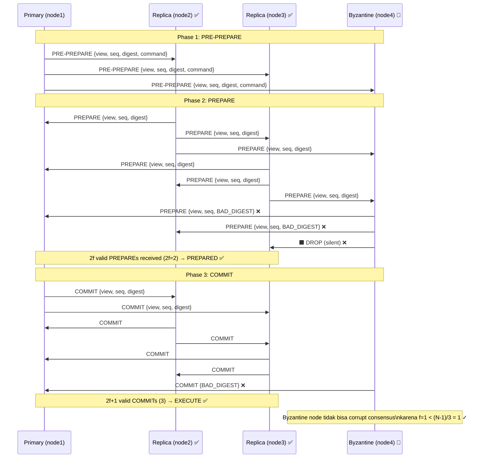

### Toleransi Byzantine

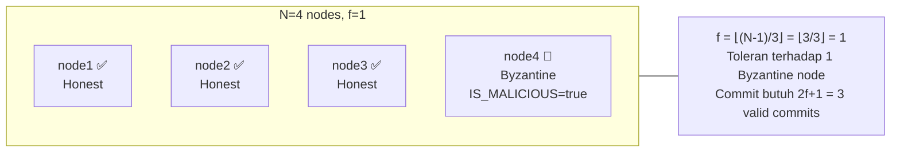

---

## Monitoring Stack

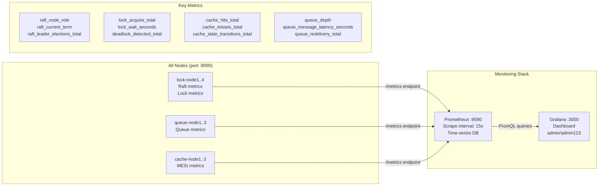

---

## Port Map

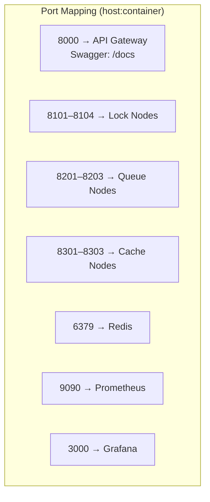
