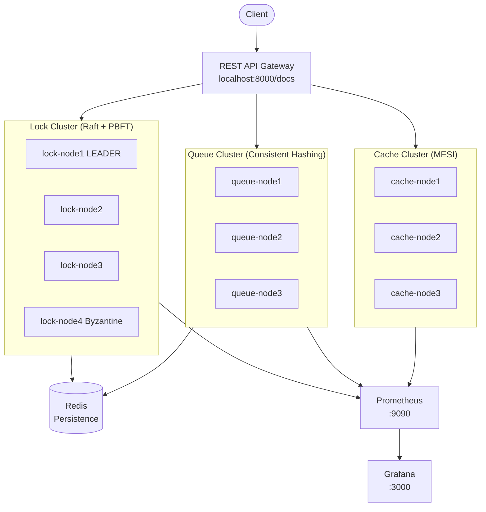
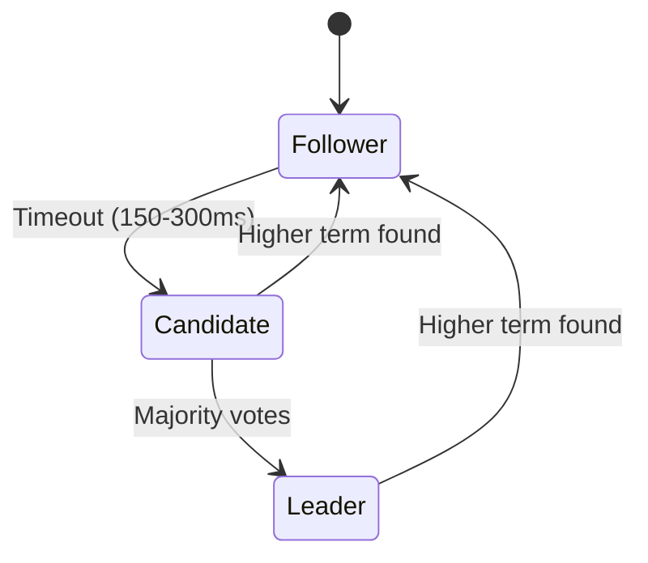
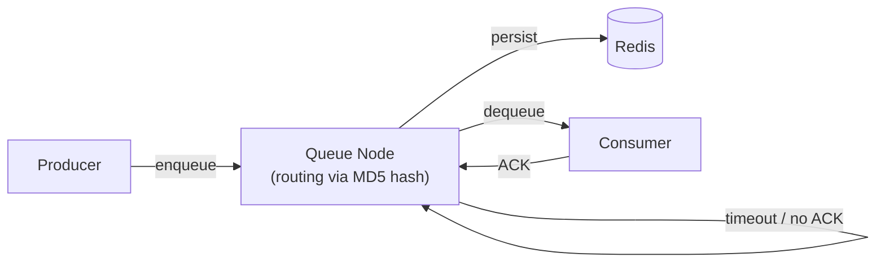
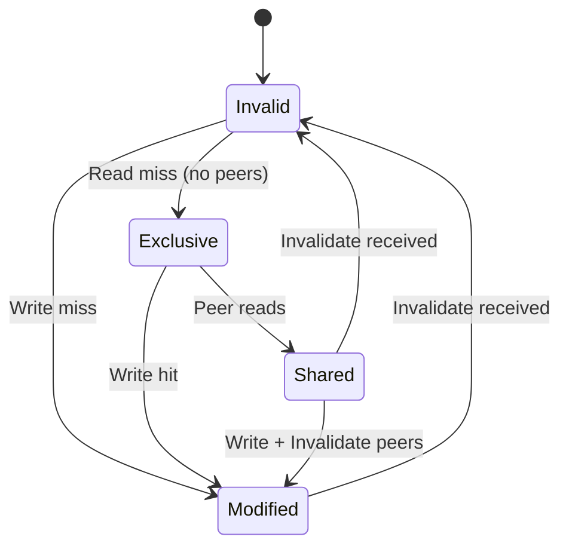
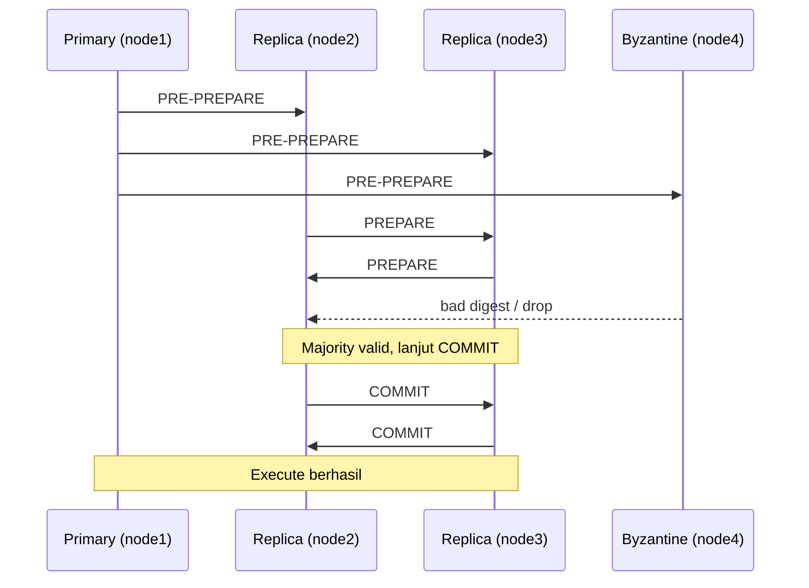

# Arsitektur Sistem Terdistribusi

## Gambaran Umum

Sistem ini mengimplementasikan tiga komponen sinkronisasi terdistribusi dalam Docker cluster:

| Komponen | Algoritma | Nodes |
|---|---|---|
| Distributed Lock Manager | Raft + PBFT | 4 |
| Distributed Queue | Consistent Hashing | 3 |
| Distributed Cache | MESI Protocol | 3 |

---

## Arsitektur Keseluruhan

---

## A. Raft Consensus — State Node

**Alur commit:**
1. Client kirim command ke Leader
2. Leader kirim `AppendEntries` ke semua Follower
3. Jika **majority** (n/2+1) balas — commit
4. Leader update semua Follower via heartbeat

---

## B. Distributed Queue — Consistent Hashing

- 150 virtual nodes per node untuk distribusi merata
- At-least-once delivery: pesan di Redis sampai di-ACK

---

## C. Cache Coherence — Protokol MESI

Setiap write memicu broadcast Invalidate ke semua peer, lalu state berubah ke M (exclusive).

---

## D. PBFT Byzantine (Bonus)

Toleransi: N=4, f=1, tahan 1 malicious node. Butuh 2f+1=3 commit valid.

---

## Port Map

| Service | Host Port | Keterangan |
|---|---|---|
| API Gateway | 8000 | Swagger UI di /docs |
| lock-node1..4 | 8101-8104 | Raft/PBFT nodes |
| queue-node1..3 | 8201-8203 | Queue nodes |
| cache-node1..3 | 8301-8303 | Cache nodes |
| Redis | 6379 | Persistence |
| Prometheus | 9090 | Metrics |
| Grafana | 3000 | Dashboard (admin/admin123) |
